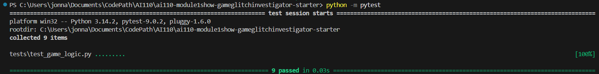
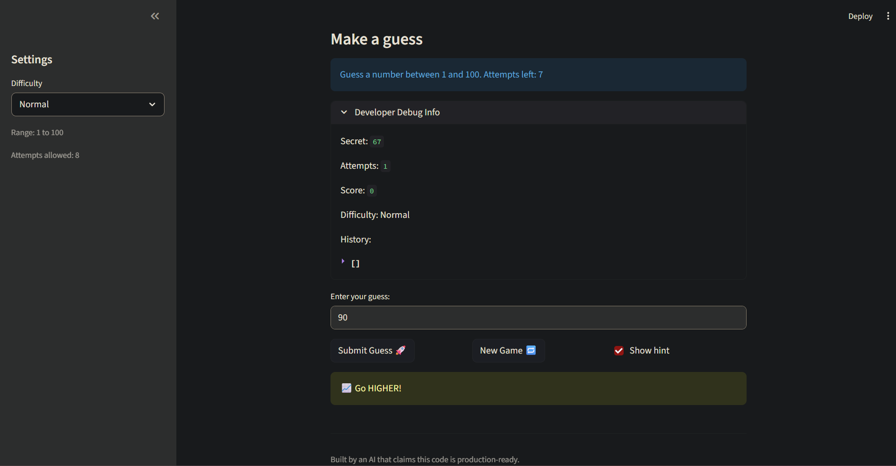

# 🎮 Game Glitch Investigator: The Impossible Guesser

## 🚨 The Situation

You asked an AI to build a simple "Number Guessing Game" using Streamlit.
It wrote the code, ran away, and now the game is unplayable. 

- You can't win.
- The hints lie to you.
- The secret number seems to have commitment issues.

## 🛠️ Setup

1. Install dependencies: `pip install -r requirements.txt`
2. Run the broken app: `python -m streamlit run app.py`

## 🕵️‍♂️ Your Mission

1. **Play the game.** Open the "Developer Debug Info" tab in the app to see the secret number. Try to win.
2. **Find the State Bug.** Why does the secret number change every time you click "Submit"? Ask ChatGPT: *"How do I keep a variable from resetting in Streamlit when I click a button?"*
3. **Fix the Logic.** The hints ("Higher/Lower") are wrong. Fix them.
4. **Refactor & Test.** - Move the logic into `logic_utils.py`.
   - Run `pytest` in your terminal.
   - Keep fixing until all tests pass!

## 📝 Document Your Experience

- [ ] Describe the game's purpose.
      This is a guessing game (with three modes: Easy, Normal, Hard) where the user is to guess a number within a range. The guess checker allows a fixed number of tries with hints informing the user of whether they need to go higher or lower
- [ ] Detail which bugs you found.
      1. New button functionality originally didn't fully work. When users try to submit new guesses, it won't allow them as the states aren't updated.
      2. The guess vs secret number check was not working where the "higher"/"lower" message is opposite of what it should be.
- [ ] Explain what fixes you applied.
      1. The issue was cused by the history and game's state not being reverted back to the original, and so I emptied/reverted both states
      2. I reversed the logic, and so if the guess is lower than it should be, the message outputs "Too Low" and if it's too high then "Too High"

## 📸 Demo

- [ ] []

## 🚀 Stretch Features

- [ ] [If you choose to complete Challenge 4, insert a screenshot of your Enhanced Game UI here]
